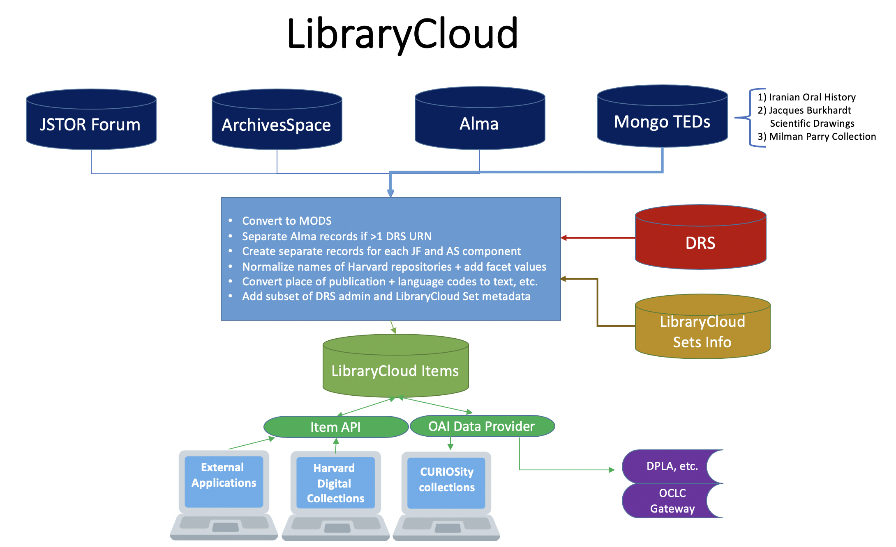
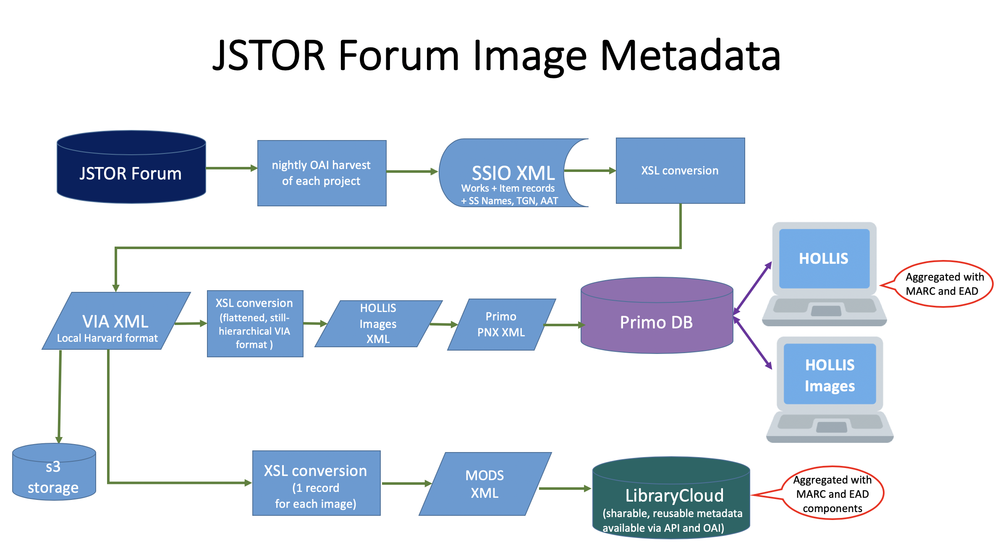

**Note: This is a draft that is very much a work in progress!**

<!-- The below is an example of how the current document MODS Application Profile for LibraryCloud could be rendered in markdown (.md) format. There's a helpful [cheat sheet for markdown syntax here](https://github.com/adam-p/markdown-here/wiki/Markdown-Cheatsheet).
GitHub's version of Markdown is [GitHub Flavord Markdown (GFM)](https://github.github.com/gfm/). It allows for tables and other useful display features.

[View on GitHub](https://github.com/joemull/mods-application-profile/blob/master/README.md). -->

---

# MODS Application Profile for LibraryCloud
_Draft, rev. 2019-06-28_


## Contents

* [Overview](#Overview)
  * [Description](#Description)
  * [Sources and Transformations](#Sources-and-Transformations)
* [Essential Features](#Essential-Features)
  * [Record Splitting](#Record-Splitting)
    * [Alma](#Alma)
    * [JSTOR Forum](#JSTOR-Forum)
    * [ArchivesSpace](#ArchivesSpace)
  * [Heirarchical Description](#Heirarchical-Description)
  * [Non-Latin Script Metadata](#Non-Latin-Script-Metadata)
* [Profile by MODS Top-Level Element](#Profile-by-MODS-Top-Level-Element)
  * [titleInfo](#titleInfo)
  * [name](#name)
  * [typeOfResource](#typeOfResource)
  * [genre](#genre)
  * [originInfo](#originInfo)
    * [place](#place)
    * [Date Elements](#Date-Elements)
  * [language](#language)
  * [location](#location)
    * [physicalLocation](#physicalLocation)
    * [url](#url)
  * [physicalDescription](#physicalDescription)
  * [abstract](#abstract)
  * [tableOfContents](#tableOfContents)
  * [targetAudience](#targetAudience)
  * [part](#part)
  * [note](#note)
  * [subject](#subject)
  * [classification](#classification)
  * [relatedItem](#relatedItem)
  * [accessCondition](#accessCondition)
  * [extension](#extension)
  * [recordInfo](#recordInfo)
* [Appendix 1: Mods Extensions](#Appendix-1-MODS-Extensions)
  * [cdwalite:cultureWrap](#cdwalite-cultureWrap)
  * [cdwalite:indexingMaterialsTechSet](#cdwalite-indexingMaterialsTechSet)
  * [cdwalite:styleWrap](#cdwalite-styleWrap)
  * [DRSMetadata](#DRSMetadata)
    * [inDRS](#inDRS)
    * [accessFlag](#accessFlag)
    * [contentModel](#contentModel)
* [Appendix 2: relatedItem Examples](#Appendix-2-relatedItem-Examples)

## Overview

### Description

Harvard’s LibraryCloud service provides API access to descriptive metadata for Harvard Library resources. LibraryCloud metadata is openly available to the public. Anyone can use the API to find, gather, and repurpose the metadata. It also is used within Harvard Library applications--for example, by serving metadata to [Harvard Digital Collections](https://library.harvard.edu/digital-collections) and [CURIOSity Digital Collections](https://curiosity.lib.harvard.edu/)--and it underlies sites and services developed throughout the Harvard community. It also supports Harvard’s partnerships with initiatives such as DPLA. As such, the metadata aims to balance internal and external requirements and expectations.

### Sources and Transformations

LibraryCloud aggregates descriptive metadata from a variety of sources, mainly

- Alma, the integrated library system where the bulk of library cataloging is created
- JSTOR Forum, where most Harvard Library visual resources are described
- ArchivesSpace, for archival materials

Each source uses different metadata standards and vocabularies appropriate to its scope and function. To facilitate searching across and reusing the disparate metadata aggregated in LibraryCloud, the source metadata is converted into a common format, [MODS](https://www.loc.gov/standards/mods/).

MODS version 3.6 is the base format of all metadata returned by the LibraryCloud Item API. The [documentation](https://www.loc.gov/standards/mods/mods-outline-3-6.html) of the MODS standard is comprehensive; therefore, this profile focuses on implementation-specific and source-specific aspects of the metadata in LibraryCloud.

There are six sources of descriptive metadata records in LibraryCloud:

| Source Name | Source Code | Number of Records | Source Format | Transformation to MODS |
|:---|:---|:---|:---|:---|
| Alma | MH:ALMA | >15,000,000 | MARCXML | A [lightly customized version](https://github.com/harvard-library/librarycloud_ingest/blob/release/1.5.0/src/main/resources/MARC21slim2MODS3-6.xsl) of the Library of Congress MARC-to-MODS stylesheet MARC21slim2MODS3-6.xsl. |
| ArchivesSpace | MH:OASIS | >2,300,000 | Encoded Archival Description (EAD) | EAD files are converted to individual MODS records for each [archival component](https://github.com/harvard-library/librarycloud_ingest/blob/release/1.5.0/src/main/resources/eadcomponent2mods.xsl). |
| JSTOR Forum | MH:VIA | >7,000,000 | VIA XML | JSTOR Forum’s SSIO XML is first converted to Harvard’s legacy [VIA format](http://hul.harvard.edu/ois/xml/xsd/via/newvia.xsd), and then [from VIA to MODS](https://github.com/harvard-library/librarycloud_ingest/blob/release/1.5.0/src/main/resources/viacomponent2mods.xsl). Individual MODS records are created for each JSTOR Forum image record, whether or not the image has been digitized. |
| Iranian Oral History Project | MH:IOHP | ~900 | Custom | [Custom](https://github.com/harvard-library/librarycloud_ingest/blob/master/src/main/resources/mpcol2mods.xsl) |
| Jacques Burkhardt Scientific Drawings | MH:MCZArtwork | ~1,000 | Custom | [Custom](https://github.com/harvard-library/librarycloud_ingest/blob/master/src/main/resources/mcz2mods.xsl) |
| Milman Parry Collection of Oral Literature | MH:MHPL | ~1,800 | Custom | [Custom](https://github.com/harvard-library/librarycloud_ingest/blob/master/src/main/resources/iohp2mods.xsl) |

The records undergo other transformations, normalizations, and enrichments to improve their interoperability and usefulness in the aggregated environment:

-	Incoming records are split into separate records when they represent multiple resources.
-	The names of Harvard libraries and archives are normalized into a standard full form, and a short form for faceting.
-	Text equivalents are added when the original metadata contains coded values for language and country/state of publication.
-	Records that describe digital resources in Harvard’s Digital Repository Service (DRS) are augmented with a subset of administrative metadata about those resources.
-	Records included in CURIOSity collections or other curatorial or administrative sets will include brief information about those sets.

Note that LibraryCloud is not the database of record for this metadata. The metadata in LibraryCloud is neither definitive nor exhaustive. Additional metadata and more specifically-defined metadata can be found in the source systems that provide metadata to LibraryCloud.






## Essential Features

### Record Splitting
<!-- This section is very important; not sure where to put it. -Robin -->

Each incoming record will be transformed into one __or more__ MODS records. A record will be split during this process if it represents more than resource according to specific criteria per contributing source.

| Name | Transformation into MODS | `recordIdentifier` construction | Examples |
|---|---|---|---|
| Alma | If the incoming record contains more than one DRS URL for deliverable digital content (i.e., not counting a preview URL, such as a thumbnail image), one record will be created with all URLs plus all physical locations AND a separate record will be created for each digital manifestation. | The MODS recordIdentifier for each of the split records will concatenate the original Alma record identifier, an underscore, and the URN portion of the DRS URL to the deliverable content. | [Alma example record](https://api.lib.harvard.edu/v2/items/990088020470203941_HBS.Baker:10771779) |
| JSTOR Forum | If the incoming record contains more than one item (`<display:DR>`), a separate MODS record will be created for each item, each record containing information about the work plus information about one of the items.  There is no record in LibraryCloud for the Work alone or the work with all items. | The MODS `recordIdentifier` for the split records will concatenate the Work record identifier, an underscore, and either 1) the URN portion of the DRS URL to the deliverable content, or 2) the item record identifier, if the item does not reference digital content. | [JSTOR Forum example 1](https://api.lib.harvard.edu/v2/items/S19482_urn-3:FHCL:3116579) <br> [JSTOR Forum example 2](https://api.lib.harvard.edu/v2/items/S19482_olvsurrogate186373) |
| ArchivesSpace | For each finding aid (Encoded Archival Description [EAD] file), a separate MODS record will be created for every described component. No record will be created for the archival resource (aka collection) itself, because that would redundant with the corresponding collection-level cataloging record from Alma. Each component record will inherit key fields from the hierarchy of the finding aid to ensure that the archival object is placed in context. | The MODS `recordIdentifier` for each of the split records will be the component id (Ref ID) of the archival object record. | [ArchivesSpace example record](https://api.lib.harvard.edu/v2/items/hou01365c02879) |

<!-- Sadly, the explanation about JSTOR Forum needs even more detail, since prior record identifiers are used for records created before the migration to JSTOR Forum, and JSTOR Forum record identifiers for records created in JSTOR Forum. -Robin -->

### Hierarchical Description using `relatedItem`
MODS consists of 20 top-level elements or element wrappers, all of which are optional and repeatable. Top-level elements may have subelements that, taken together within an instance of a top element, represent a single concept.

One of the MODS elements, `relatedItem`, allows for great flexibility in the way the description of a resource is structured that has implications for applications that consume the metadata.

All MODS top-level elements are valid within `relatedItem`. `relatedItem` has many uses, but one is crucial to the aggregation of metadata in LibraryCloud: it enables nested, hierarchical whole/part description. __For ArchivesSpace and JSTOR Forum records, `relatedItem` information is necessary to provide context or specificity about the described resource.__

Records from JSTOR Forum and from ArchivesSpace both take advantage of this hierarchical structure, but in different ways. In both cases, the record overall represents one resource (which may be a compound resource, such as a folder of letters that are not individually described) and a larger context for it. However, in ArchivesSpace records, the description moves from narrower to broader, while in JSTOR Forum, the description moves from the broader context to the specific item.

The `type` and `displayLabel` attributes in the `relatedItem` element indicate the kind of relationship:

| Element | Relationship |
|:--- |:---|
| `<relatedItem type="host">` | A larger context of which the described resource is a part. |
| `<relatedItem type="host" displayLabel="collection">` | The largest unit –the collection—of which the resource is a part. |
| `<relatedItem type="constituent">` | An item which is part of or representative of the primary object of description. |

Records for archival components from ArchivesSpace start with the description of one component of a collection, followed by __any number__ of levels of description that provide the context of that component within the collection.

For example, note the nested uses of `relatedItem` in [this record](https://api.lib.harvard.edu/v2/items?recordIdentifier=hou01365c02879).

| Element | Relationship |
|:---|:---|
| Record |  |
| __Sub-Series |	`<relatedItem type=”host”>` |
| ____Series | `<relatedItem type=”host”>` |
| ______Collection | `<relatedItem type=”host” displayLabel=”collection”>` |

Records from JSTOR Forum, in contrast, start with the broader description of a painting, building, event, etc., and may have 0-2 additional levels of description for a specific view, such as a perspective, a detail, or a verso.

Here is an [example record](https://api.lib.harvard.edu/v2/items?recordIdentifier=W209586_urn-3:VIT.BB:25445424):

| Element | Relationship |
|:---|:---|
| Painting |  |
| __X-Ray (detail) | `<relatedItem type=”constituent”>` |

Here is [another example](https://api.lib.harvard.edu/v2/items?recordIdentifier=G80_olvsurrogate307431):

| Element | Relationship |
| --- | --- |
| Quilt series |  |
| __One Quilt | `<relatedItem type=”constituent”>` |
| ____Total view of the quilt | `<relatedItem type=”constituent”>` |

### Non-Latin Script Metadata
Non-Latin script may appear in LibraryCloud records from any source. However, the MODS `altRepGroup` attribute is only used in Alma records to designate paired elements containing corresponding information in transliteration and in vernacular script.

If an `altRepGroup` attribute is present with a value other than “00”, there will be another element with an identical `altRepGroup` value containing a representation of some or all of the element information in a different script (e.g., Arabic).

> [Example](https://api.lib.harvard.edu/v2/items?recordIdentifier=990000773410203941)


```xml
<mods:titleInfo altRepGroup="02">
  <mods:nonSort>al- </mods:nonSort>
  <mods:title>Nahḍah al-Isrāʼīlīyah wa-tārīkhuhā al-khālid</mods:title>
  <mods:subTitle>
    muzayyinan bi-rusūm ʻuẓmāʼ al-Isrāʼīlīyīn fī al-ʻālam
  </mods:subTitle>
</mods:titleInfo>

<mods:titleInfo altRepGroup="02">
  <mods:title>نهضة الاسرائيلية وتاريخها الخالد</mods:title>
  <mods:subTitle>مزينا برسوم عظماء الاسرائيلية في العالم</mods:subTitle>
</mods:titleInfo>
```

Non-Latin script metadata may occur in records from other sources, but it will not be marked for association with its transliteration.

## Profile by MODS Top-Level Element
### titleInfo

Most, but not all, records will include at least one top-level `titleInfo` element. The exception is a subset of archival component records from ArchivesSpace. Lacking a `titleInfo`, these are required to have a top-level `originInfo`/`dateCreated`. See an [example](https://api.lib.harvard.edu/v2/items?q=hou02652c00990).

##### Attribute Usage: `type` or `otherType`
- `type` values: abbreviated, translated, alternative, uniform
- `otherType` values are not controlled
- `titleInfo` elements that contain neither `type` nor `otherType` attributes can be considered primary titles

##### Subelements
`titleInfo` is a wrapper element

| Subelement | May occur in records from |
|:---|:---|
| `title` | Alma, JSTOR Forum, ArchivesSpace |
| `subTitle` | Alma |
| `partNumber` | Alma |
| `nonSort` | Alma |

When multiple subelements are used, their order is important and should be retained in displays to insure intelligibility.

### name

TBD

### typeOfResource
`typeOfResource` appears in Alma and JSTOR Forum records; it is not present in ArchivesSpace records. While repeatable, it is not, in fact, repeated.
Alma records can contain any of the values enumerated in the MODS 3.6 schema. All JSTOR Forum records will have the value `“still image”`.

##### Attribute Usage
`collection = "yes"`
Records from Alma representing manuscript material will contain the `typeOfResource` attribute `manuscript = "yes"`

`manuscript = "yes"`
Records from Alma representing manuscript material will contain the `typeOfResource` attribute `manuscript = "yes"`

### genre
The `genre` element is present in many Alma records, nearly all JSTOR Forum records, and all Jacques Burkhardt records.

It is not present in ArchivesSpace records, Iranian Oral History, or Milman Parry records.

### originInfo
The `originInfo` element is a wrapper for information about the creation or issuance of the resource.

| Subelement | May occur in records from |
|:---|:---|
| `place/placeTerm` | Alma, JSTOR Forum, ArchivesSpace |
| `publisher` | Alma |
| `copyrightDate` | Alma |
| `dateCreated` | Alma, JSTOR Forum, ArchivesSpace |
| `dateIssued` | Alma |
| `dateOther` | JSTOR Forum |

#### place
The `place` wrapper element will contain one or more `placeTerm` elements. If more than one `placeTerm` is present within a single `place` element, all `placeTerms` contain different representations of the same place.

[Example](https://api.lib.harvard.edu/v2/items/990026310040203941)

```xml
<mods:place>
  <mods:placeTerm authority="marccountry" type="code">miu</mods:placeTerm>
  <mods:placeTerm authority="marccountry" type="text">Michigan</mods:placeTerm>
</mods:place>
<mods:place>
  <mods:placeTerm type="text">Detroit</mods:placeTerm>
</mods:place>
```

Note the use of the attribute `type = "code"` in Alma records.

#### Date Elements
MODS supports seven different elements to express dates associated with the creation of a resource. Any of these may appear in LibraryCloud, but generally ArchivesSpace and JSTOR Forum dates will be in the `dateCreated` element, while Alma dates will use `dateIssued`.

##### Date Elements Attribute Usage
Date elements with no attributes or with the keyDate attribute are free-text date expressions suitable for display.

Some attributes are important for applications that use LibraryCloud metadata.

`encoding`
The encoding attribute will only occur in records from Alma, and the only value is `“marc”`. These date elements are designed to support date and date-range searching and are best omitted from displays.

`point`
These date elements designate the start and end of a date range. They support date-range searching and can be omitted from displays. There will typically be another date element better suited for display in the same `originInfo` element or in a sibling `originInfo` element.

`keyDate`
The keyDate attribute only appears in JSTOR Forum records. It duplicates dateCreated [lacking attributes] in `dateOther` with `keyDate="yes"`.

```xml
<mods:originInfo>
  <mods:dateOther keyDate="yes">early/mid 20th century</mods:dateOther>
  <mods:dateCreated point="start">1910</mods:dateCreated>
  <mods:dateCreated point="end">1960</mods:dateCreated>
  <mods:dateCreated>early/mid 20th century</mods:dateCreated>
</mods:originInfo>
```

### language
All Alma records contain one or more coded language designation in a `languageTerm` element. The primary language code will also be available as text in a second `languageTerm` element in the same language parent element. `languageTerms` for different languages, as opposed to different ways of expressing the same language, will be in separate language elements.  

Use the `type` attribute to select between code and text values.

```xml
<mods:language>
  <mods:languageTerm authority="iso639-2b" type="code">per </mods:languageTerm>
  <mods:languageTerm authority="iso639-2b" type="text">Persian </mods:languageTerm>
```

JSTOR Forum records do not contain language information, so for the purposes of LibraryCloud, the following has been added to all records derived from JSTOR Forum:

```xml
<mods:languageTerm type="code">zxx</mods:languageTerm>
<mods:languageTerm type="text">No linguistic content</mods:languageTerm>
```

In ArchivesSpace records, language is set at the collection-level and may not be accurate for all items in the collection. For that reason, item level records derived from ArchivesSpace contain.

```xml
<mods:languageTerm authority="iso639-2b" type="code">und</mods:languageTerm>
<mods:languageTerm authority="iso639-2b" type="text">Undefined</mods:languageTerm>
```

### location
The two most important uses of location in LibraryCloud records are for 1) information about the Harvard repository holding the material, and 2) links to digital content.

#### physicalLocation
There can be none, one, or several `location` elements each containing one `physicalLocation`. Instances of `physicalLocation` that represent Harvard holdings will contain the attribute `displayLabel="Harvard repository"`. Most of these will also contain a `valueURI` attribute with a URI from International Standard Name Identifier (ISNI) or the Library of Congress Name Authority File (LCNAF).

#### url

- `mods:url access="raw object"` designates deliverable digital content in the DRS.
- `mods:url access="preview"` designates thumbnail images for content in the DRS.
- `mods:url access="object in context"` links to the bibliographic record for the digital content from the DRS within a curated collection site. The specific collection will be indicated with a displayLabel attribute, e.g., `displayLabel="Harvard Digital Collections"`.

### physicalDescription

TBD

#### extent

#### form

#### note

### abstract
Records from Alma, JSTOR Forum, and ArchivesSpace may contain in the `abstract` element.

### tableOfContents
Only Alma records can contain in the `tableOfContents` element.

### targetAudience
almost non-existent in LibraryCloud

### part
almost non-existent in LibraryCloud

### note
TBD

### subject
`subject` is a wrapper element.

### classification
In LibraryCloud, only Alma ...

### relatedItem
ALMA

The MODS `relatedItem type` attribute contains enumerated values: `preceding`, `succeeding`, `original`, `host`, `constituent`, `series`, `otherVersion`, `otherFormat`, `isReferencedBy`, `references`, `reviewOf`. Examples in _Appendix TBD_.

Alternatively, the `otherType` attribute ...

See _Special Topics: Hierarchical Description_ for other uses of `relatedItem`.

### accessCondition
`displayLabel - "copyright"`
`type = "useAndReproduction"`

### extension
LibraryCloud records will contain one or more MODS `extension` elements to augment the basic descriptive metadata record.

Some extensions carry descriptive metadata that cannot otherwise be expressed in MODS: style, culture, and materials, techniques, and support.
- `cdwalite:cultureWrap`
- `cdwalite:indexingMaterialsTechSet`
- `cdwalite:styleWrap`

The other category of extensions supplements the original metadata with related metadata from other systems, with administrative information, or with metadata values normalized to support particular functions. These extensions are
- `DRSMetadata`  
- `librarycloud`
- `sets`

For details, see _Appendix 1: MODS Extensions_, below.

### recordInfo
A LibraryCloud record will contain one or more `recordInfo` wrapper elements, with at most one occurrence per level of hierarchy. That is, each `relatedItem` may also include a `recordInfo` element that applies specifically to the content of that related item. The primary `recordInfo`--the one that applies to the record as a whole--occurs at the top level of the record. Only the primary `recordInfo` will include the source attribute.

The subelements within the primary `recordInfo` element vary by source, but all will include `recordIdentifier` and `recordChangeDate`.

JSTOR Forum Example:
``` xml
<mods:recordInfo>
  <mods:recordContentSource authority="marcorg">MH</mods:recordContentSource>
  <mods:recordContentSource authority="marcorg">MH-VIA </mods:recordContentSource>
  <mods:recordChangeDate encoding="iso8601">20181109</mods:recordChangeDate>
  <mods:recordIdentifier source="MH:VIA">8000464237_urn-3:FHCL.JUD:9806298</mods:recordIdentifier>
  <mods:languageOfCataloging>
    <mods:languageTerm>eng</mods:languageTerm>
  </mods:languageOfCataloging>
</mods:recordInfo>
```

Alma Example:
``` xml
<mods:recordInfo>
  <mods:recordCreationDate encoding="marc">821202</mods:recordCreationDate>
  <mods:recordChangeDate encoding="iso8601">20180528</mods:recordChangeDate>
  <mods:recordIdentifier source="MH:ALMA">990000000020203941</mods:recordIdentifier>
  <mods:recordOrigin>
    Converted from MARCXML to MODS version 3.6 using MARC21slim2MODS3-6.xsl (Revision 1.117 2017/02/14)
  </mods:recordOrigin>
</mods:recordInfo>
```

ArchivesSpace Example:
``` xml
<mods:recordInfo>
  <mods:recordChangeDate encoding="iso8601">20190523</mods:recordChangeDate>
  <mods:recordIdentifier source="MH:OASIS">hua03010c00264</mods:recordIdentifier>
</mods:recordInfo>
```

## Appendix 1: MODS Extensions

### cdwalite:cultureWrap
`cultureWrap` is a wrapper element containing a single `cdwalite:culture` element. Multiple cultures will appear in separate extensions. This extension only occurs in JSTOR Forum records.

``` xml
<mods:extension>
  <cdwalite:cultureWrap xmlns:cdwalite="http://www.getty.edu/research/conducting_research/standards/cdwa/cdwalite">
    <cdwalite:culture>Egyptian</cdwalite:culture>
  </cdwalite:cultureWrap>
</mods:extension>
```

### cdwalite:indexingMaterialsTechSet
`indexingMaterialsTechSet` is a wrapper element containing a single `cdwalite:termMaterialsTech` element. Multiple materials or techniques will appear in separate extensions. This extension only occurs in JSTOR Forum records.

``` xml
<mods:extension>
  <cdwalite:indexingMaterialsTechSet xmlns:cdwalite="http://www.getty.edu/research/conducting_research/standards/cdwa/cdwalite">
    <cdwalite:termMaterialsTech>granite</cdwalite:termMaterialsTech>
  </cdwalite:indexingMaterialsTechSet>
</mods:extension>
```

### cdwalite:styleWrap
`styleWrap` is a wrapper element containing a single `cdwalite:style` element. Multiple styles will appear in separate extensions. This extension only occurs in JSTOR Forum records.

Example:

``` xml
<mods:extension>
  <cdwalite:styleWrap xmlns:cdwalite="http://www.getty.edu/research/conducting_research/standards/cdwa/cdwalite">
    <cdwalite:style>New Kingdom</cdwalite:style>
  </cdwalite:styleWrap>
</mods:extension>
```

### DRSMetadata
The `DRSMetadata` extension includes a subset of administrative and technical metadata copied from the Harvard Digital Repository Service (DRS) to facilitate discovery and use of digital content available from the DRS.

#### DRSMetadata Entailments
| Element | Attributes | Content | Obligation | Repeatable | Contained In |
|:---|:---|:---|:---|:---|:---|
| `inDRS` | None | `True` | Required | No | //HarvardDRS:DRSMetadata |
| `accessFlag` | None | Controlled values: `P` (public), `R` (restricted)  | Required | No | //HarvardDRS:DRSMetadata |
| `contentModel` | None  |  Controlled values: `STILL IMAGE`, `PDS DOCUMENT`, `DOCUMENT`, `AUDIO`, `TEXT`, `PDS DOCUMENT LIST`, `VIDEO` | Required | No | //HarvardDRS:DRSMetadata |
| `uriType` | None | Controlled values: `FDS`, `IDS`, `PDS`, `PDS_LIST`, `SDS`, `SDS_VIDEO` | Optional | No | //HarvardDRS:DRSMetadata |
| `fileDeliveryUrl` | None |  | Required | No | //HarvardDRS:DRSMetadata |
| `ownerCode` | None | [is there a public code list?] | Required | No | //HarvardDRS:DRSMetadata |
| `ownerCodeDisplayName` | None | A text string [is there a public code list?] | Required | No | //HarvardDRS:DRSMetadata |
| `metsLabel` | None | A text string | Optional | No | //HarvardDRS:DRSMetadata |
| `lastModificationDate` | None | ISO8601 timestamp in the form `YYYY-MM-DDThh:mm:ss.SSSZ` | Required | No | //HarvardDRS:DRSMetadata |

<!-- Add DRSMetadata wrapper -->

#### inDRS
A flag indicating that there is digital content in the DRS associated with this record.

```xml
<HarvardDRS:inDRS>true</HarvardDRS:inDRS>
```

Note: The element exists to facilitate searching and faceting. Only `inDRS="true"` is explicit in the metadata. Any record lacking a DRSMetadata extension will be recorded as `inDRS=“false”` in the LibraryCloud Item API, and there will be no DRSMetadata extension in the record.

#### accessFlag
A code indicating whether the DRS digital content is accessible to the public or is restricted to Harvard affiliates.

```xml
<HarvardDRS:accessFlag>P</HarvardDRS:accessFlag>
```

Note: The value applies to a file in the DRS if the URN in the LibraryCloud record resolves to a specific file.  If the URN resolves to a multifile object, the `accessFlag` will be the least restrictive `accessFlag` value associated with any deliverable file in the object.

#### contentModel

An indication of type and structure of the digital object in the DRS.
```xml
<HarvardDRS:contentModel>STILL IMAGE</HarvardDRS:contentModel>
```

#### uriType
A code for the type of service that will be used to deliver the content to the user.

```xml
<HarvardDRS:uriType>SDS</HarvardDRS:uriType>
```

Note: Delivery service types: FDS (text documents), IDS (images), PDS (page-turned objects), PDS_LIST (list of page-turned objects), SDS (streaming audio), SDS_VIDEO (streaming video)

#### fileDeliveryUrl
The persistent identifier for delivery of the DRS content.

```xml
<HarvardDRS:fileDeliveryURL>https://nrs.harvard.edu/urn-3:FHCL:2789166</HarvardDRS:fileDeliveryURL>
```

Note: This URL serves to associate a URL in descriptive record with its corresponding DRS metadata. Despite its name, it does not necessarily correspond to a delivered file. Most often it delivers content in a dedicated viewer or rendering application.

#### ownerCode

A DRS code identifying the Harvard library, archive, or other repository responsible for the digital content.

```xml
<HarvardDRS:ownerCode>FHCL.HOUGH</HarvardDRS:ownerCode>
```

Note: This value is expanded into the human-readable text form of the unit name in the ownerCodeDisplayName element.

#### ownerCodeDisplayName

The DRS name for the Harvard library, archive, or other repository responsible for the digital content.

```xml
<HarvardDRS:ownerCodeDisplayName>Houghton Library</HarvardDRS:ownerCodeDisplayName>
```

This value corresponds to the code for the unit name in the ownerCode element.

#### metsLabel

A descriptive string from the METS object descriptor file in the DRS for identifying an object to a user.

```xml
<HarvardDRS:metsLabel> LN 93. Derviš, Zilić. Ide Tito preko Romanije. Stolac, June 9, 1950. Albert B. Lord Collection. Milman Parry Collection of Oral Literature.</HarvardDRS:metsLabel>
```

#### lastModificationDate

The date and time of the most recent update to the object in the DRS.

```xml
<HarvardDRS:lastModifiedDate>2015-11-02T15:06:39.404Z</HarvardDRS:lastModifiedDate>
```

### librarycloud Extension
The librarycloud extension provides alternative, normalized, or user-friendly values to improve searching, faceting, or display, as well as auxiliary and administrative information.

The elements may occur together in one librarycloud wrapper element in a single mods:extension or split across more than one mods:extension, and they may occur at any level of the hierarchy.

<!-- This section may be more readable if formatted into a single table for details and a list of definitions and examples, like the above section. -->

<!-- Add table block for librarycloud wrapper -->

| Element | `availableTo` |
|:---|:---|
| Description | A single value that represents the broadest access for any DRS content referenced by the LibraryCloud record. If any part of the DRS content is public, the value will be “Everyone”. |
| Attributes | None |
| Content | Values: <ul><li>Everyone</li><li>Harvard only</li></ul> |
| Obligation | Optional |
| Repeatable | No |
| Contained In | //librarycloud:librarycloud |
| Note | availableTo values are derived from HarvardDRS:accessFlag values. <ul><li>accessFlag<code>&#129130;</code>P Everyone</li><li>accessFlag<code>&#129130;</code>R Harvard only</li></ul>  Two types of content may have inaccurate values: <ol><li>Restricted images that have separate thumbnail images deposited in the DRS will appear as “Everyone”</li><li>Restricted Audio content that is accessed through a DRS playlist appears as “Everyone” because the playlist is public, even if the underlying audio files are not. </li></ol>|
| Example | `<librarycloud:availableTo>Everyone</librarycloud:availableTo>` |

| Element | `DigitalFormats` |
|:---|:---|
| Description | DigitalFormats is a wrapper element containing one DigitalFormat element for each type of DRS content described in the LibraryCloud record. |
| Attributes | None |
| Content | Subelement: <ul><li>`DigitalFormat`</li></ul> |
| Obligation | Required |
| Repeatable | No |
| Contained In | //librarycloud:librarycloud |
| Note | Most LibraryCloud records will contain no more than one |
| Example | See under DigitalFormat below. |

| Element | `DigitalFormat` |
|:---|:---|
| Description | DigitalFormat contains a descriptive word or phrase for the type of DRS content described in the LibraryCloud record. The values are derived from a combination of the DRSMetadata contentModel and uriType elements. |
| Attributes | None |
| Content | Controlled values: <ul><li>Audio -- when `ContentModel=AUDIO` or (`ContentModel=TEXT` and `uriType=SDS`)</li><li>Books and documents -- when `ContentModel=DOCUMENT`, `PDS_DOCUMENT`, or `PDS_LIST_OBJECT`</li><li>Images -- when `ContentModel=STILL_IMAGE`</li><li>Videos  -- when `ContentModel=VIDEO`</li></ul> |
| Obligation | Required |
| Repeatable | No |
| Contained In | //librarycloud:librarycloud/librarycloud:DigitalFormats |
| Note | Most LibraryCloud records will contain no more than one DigitalFormat element. |
| Example |  `<librarycloud:digitalFormats> <librarycloud:digitalFormat>Audio</librarycloud:digitalFormat> <librarycloud:digitalFormat>Books and documents</librarycloud:digitalFormat></librarycloud:digitalFormats>` |

| Element | `HarvardRepositories` |
|:---|:---|
| Description | HarvardRepositories is a wrapper element containing one HarvardRepository element for each unique repository name occurring in the LibraryCloud record. |
| Attributes | None |
| Content | Subelement: <ul><li>`HarvardRepository`</li></ul> |
| Obligation | Optional |
| Repeatable | No |
| Contained In | //librarycloud:librarycloud |
| Note | The form of the value in //physicalLocation[@displayLabel=”Harvard repository”] |
| Example | See under HarvardRepository below. |

| Element | `HarvardRepository` |
|:---|:---|
| Description | HarvardRepository contains the short form of the name of a Harvard repository appearing in the LibraryCloud record. Each HarvardRepository value will occur only once per record. |
| Attributes | None |
| Content | Text |
| Obligation | Required |
| Repeatable | Yes |
| Contained In | //librarycloud:HarvardRepositories |
| Note | Each unique value in //physicalLocation[@displayLabel=”Harvard repository”] will be mapped to a corresponding short form of repository name. The forms are added from the normalization file RepositoryNameMapping.xml. |
| Example | `<librarycloud:HarvardRepositories> <librarycloud:HarvardRepository>Houghton</librarycloud:HarvardRepository> <librarycloud:HarvardRepository>Widener</librarycloud:HarvardRepository> </librarycloud:HarvardRepositories>`  |

| Element | `originalDocument` |
|:---|:---|
| Description | This element contains a URL link to a downloadable copy of the source record from which the LibraryCloud record was derived. |
| Attributes | None |
| Content | URL |
| Obligation | Required |
| Repeatable | No |
| Contained In | //librarycloud:librarycloud |
| Note | The source record referred to by the originalDocument link may already have transformed from the internal format of the source system before it reaches the LibraryCloud ingest process. More than one LibraryCloud may be derived from the same source record. See Record Splitting in the MODS Application Profile for LibraryCloud |
| Example | `<librarycloud:originalDocument> https://s3.amazonaws.com/harvard.librarycloud.marc/990014252210203941</librarycloud:originalDocument>`  |


| Element | `priorrecordids` |
|:---|:---|
| Description | Contains one or more subelements containing superseded identifiers for the record, such as those from previous generations of cataloging systems. |
| Attributes | None |
| Content | Subelement: <ul><li>`recordIdentifier`</li></ul> |
| Obligation | Optional |
| Repeatable | No |
| Contained In | //librarycloud:librarycloud |
| Note | |
| Example | |

| Element | `recordIdentifier` |
|:---|:---|
| Description | Contains a single superseded identifier for the record, such as the identifier from a previous generation of cataloging system. |
| Attributes | source <code>&#124;&#124;</code> MH:ALEPH |
| Content | |
| Obligation | Required when parent is present |
| Repeatable | Yes |
| Contained In | //librarycloud:priorrecordids |
| Note | |
| Example | `<librarycloud:recordIdentifier source="MH:ALEPH">001425221</librarycloud:recordIdentifier>` |

| Element | `processingDate` |
|:---|:---|
| Description | The processingDate element includes a timestamp for the date this version of the record was ingested by LibraryCloud.  The date is replaced each time an updated version of the record is processed. |
| Attributes | None |
| Content | Timestamp in the form YYYY-MM-DDTHH:mmZ |
| Obligation | Required |
| Repeatable | No |
| Contained In | //librarycloud:librarycloud |
| Note |
There is no date in LibraryCloud to represent the first date that a record was loaded. |
| Example | `<librarycloud:processingDate>2019-04-16T05:49Z</librarycloud:processingDate>` |

### set Extension
The set extension identifies curated collections in which the item is included, specifically collections created and maintained through Harvard’s Collection Builder service.

These sets may be available for OAI-PMH harvesting. See this [link](https://wiki.harvard.edu/confluence/display/LibraryStaffDoc/LibraryCloud+OAI-PMH+Data+Provider).

They may have dedicated exhibit sites, [e.g.](http://curiosity.lib.harvard.edu/women-working-1800-1930).

| Element | `sets` |
|:---|:---|
| Description | sets is the wrapper element containing information about each of the curated collections or sets in which the record is included. |
| Attributes | None |
| Content | Subelement: <ul><li>`set`</li></ul> |
| Obligation | Optional |
| Repeatable | No |
| Contained In | //mods:extension |
| Note | |
| Example | `<sets:sets> <sets:set> <sets:systemId>57217</sets:systemId> <sets:setName>Women Working, 1800-1930</sets:setName> <sets:setSpec>ww</sets:setSpec> <sets:baseUrl> https://id.lib.harvard.edu/curiosity/women-working-1800-1930/45- </sets:baseUrl> </sets:set> </sets:sets>` |

| Element | `set` |
|:---|:---|
| Description | set is a wrapper element containing information about a single curated collection. |
| Attributes | None |
| Content | Subelements: <ul><li>`systemId`</li><li>`setName`</li><li>`setSpec`</li><li>`baseUrl`</li></ul> |
| Obligation | Required when parent is present |
| Repeatable | Yes |
| Contained In | //sets:sets |
| Note | |
| Example | See sets, above. |

| Element | `systemId` |
|:---|:---|
| Description | The identifier of the collection record in the collection database.  |
| Attributes | None |
| Content | One numeric identifier |
| Obligation | Required when parent is present |
| Repeatable | No |
| Contained In | //sets:set |
| Note | |
| Example | `<sets:systemId>57218</sets:systemId>` |

| Element | `setName` |
|:---|:---|
| Description | A human-readable string naming the set or collection.  |
| Attributes | None |
| Content | Text string |
| Obligation | Required when parent is present |
| Repeatable | No |
| Contained In | //sets:set |
| Note | This is the same as the setName in [OAI-PMH](http://www.openarchives.org/OAI/openarchivesprotocol.html) |
| Example | `<sets:setName>Women Working, 1800-1930</sets:setName>` |

| Element | `setSpec` |
|:---|:---|
| Description | A unique identifier for the set in the context of the LibraryCloud OAI-PMH Data Provider.  |
| Attributes | None |
| Content | Text string |
| Obligation | Required when parent is present |
| Repeatable | No |
| Contained In | //sets:set |
| Note | This is the same as the setSpec in [OAI-PMH](http://www.openarchives.org/OAI/openarchivesprotocol.html) |
| Example | `<sets:setName>Women Working, 1800-1930</sets:setName>` |

| Element | `baseUrl` |
|:---|:---|
| Description | URL used to construct item level object-in-context links for records in the set or collection  |
| Attributes | None |
| Content | URL |
| Obligation | Optional |
| Repeatable | No |
| Contained In | //sets:set |
| Note | baseUrl will only be present if there is a public exhibit or site for the collection. |
| Example | `<sets:baseUrl> https://id.lib.harvard.edu/curiosity/women-working-1800-1930/45- </sets:baseUrl>` |

## Appendix 2: relatedItem examples
MH:ALMA:
<ol><li> Permalink to the record in HOLLIS:

```xml
  <mods:relatedItem otherType="HOLLIS record">
    <mods:location>
      <mods:url>https://id.lib.harvard.edu/alma/990000000230203941/catalog</mods:url>
    </mods:location>
```

</li>
<li> Unspecified - Link to Finding Aid:

```xml
  <mods:relatedItem>
    <mods:titleInfo>
      <mods:title>Electronic finding aid</mods:title>
    </mods:titleInfo>
    <mods:location>
      <mods:url>https://nrs.harvard.edu/urn-3:RAD.SCHL:sch01321</mods:url>
    </mods:location>
````

</li>
<li> Series titles:

```xml
<mods:relatedItem type="series">
  <mods:titleInfo>
    <mods:title>Tübinger Beiträge zur Linguistik ; 465</mods:title>
  </mods:titleInfo>
```

</li>
<li> Other format:

```xml
<mods:relatedItem type="otherFormat" displayLabel="Online version:" otherType="Online version:">
  <mods:titleInfo>
    <mods:title>Reversing the tide</mods:title>
  </mods:titleInfo>
    <mods:originInfo>
      <mods:publisher>Washington, DC : World Bank, 2005</mods:publisher>
    </mods:originInfo>
  <mods:identifier type="local">(OCoLC)654737656</mods:identifier>
```

</li>
<li> Constituent part:

```xml
<mods:relatedItem type="constituent">
  <mods:titleInfo>
    <mods:title>Société civile et efficacité de l'aide</mods:title>
  </mods:titleInfo>
```

</li>
<li> Larger context / Is Part OF:

```xml
  <mods:relatedItem displayLabel="part of">
    <mods:titleInfo>
      <mods:title>
      Julia Child Additional papers. Folder: Paul Child log book transcription: 6_KC64, HOLLIS collection-level record: 12694681
      </mods:title>
    </mods:titleInfo>
```

</li>
<li> Is Referenced By:

```xml
  <mods:relatedItem type="isReferencedBy">
    <mods:titleInfo>
      <mods:title>Pottle, F.A. Boswell,</mods:title>
    </mods:titleInfo>
    <mods:part>
      <mods:detail type="part">
        <mods:number>91</mods:number>
      </mods:detail>
    </mods:part>
```

</li>
</ol>
